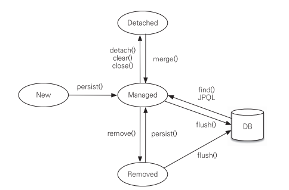

# hello-jpa

인프런 김영한 님의 "자바 ORM 표준 JPA 프로그래밍 - 기본편" 강의를 듣고 학습 내용을 간략하게 정리하기 위한 Repository

---

## 프로젝트 설정

<details>
<summary>접기/펼치기</summary>
<div markdown="1">

- java : 11
- 빌드 : Maven
- 의존 라이브러리(`pom.xml`)
  - `com.h2database:1.4.200` : H2 데이터베이스
  - `org.hibernate:hibernate-entitymanager` : 하이버네이트 엔티티 매니저
  - `javax.xml.bind:javaxb-api` : java 11 이상 의존성 추가 해야함.

</div>
</details>

---

# Section 2 - JPA 시작하기

## 2.1 JPA의 구동방식

<details>
<summary>접기/펼치기</summary>
<div markdown="1">

1. 설정정보 조회
   - `META.INF/persistence.xml`에서 Persistence 조회

2. 설정정보 기반 EntityManagerFactory 생성
   - 설정에 등록된 Persistence name 기반으로 EMF를 생성

3. 요청이 들어오고 나갈 때마다, EntityManager를 생성 후 버리기
   - enf.createEntityManger();

</div>
</details>

## 2.2 EntityManagerFactory, EntityManager

<details>
<summary>접기/펼치기</summary>
<div markdown="1">

```java
EntityManagerFactory emf = Persistence.createEntityManagerFactory("hello");

EntityManager em = emf.createEntityManager(); // 엔티티 매니저 생성
EntityTransaction tx = em.getTransaction(); // 트랜잭션 생성
tx.begin(); // 트랜잭션 시작 선언

try {
    //... 작업
    tx.commit(); // 커밋
} catch(Exception e) {
    tx.rollback();
} finally {
    em.close(); // 트랜잭션이 종료되면 EntityManager를 반환해야한다.
}

emf.close(); // 어플리케이션이 종료되기 전에 EntityManagerFactory를 반환
```
- EntityManagerFactory : 어플리케이션에서 DB당 한 개 생성
  - `persistence.xml`에서 지정해준 persistence-unit의 name을 인자로 생성하면 됨
  - 어플리케이션 구동 후 하나만 생성해서, 애플리케이션 전체에서 공유한다.

- EntityManager : 요청이 들어올 때마다 생성, 요청이 종료되면 버리면 됨
  - 여러 스레드가 공유해선 안 된다.

- EntityTransaction : 트랜잭션
  - JPA의 모든 데이터 변경은 트랜잭션 안에서 이루어져야한다.

</div>
</details>

## 2.3 JPA의 기본 CRUD

<details>
<summary>접기/펼치기</summary>
<div markdown="1">


기본적인 CRUD에 관한 메서드를 제공하는데, 데이터 변경은 트랜잭션 안에서 이루어져야한다.

- 등록 : `em.persist(...)`
- 기본키로 단건 조회 : `em.find(클래스, 기본키)
- 삭제 : `em.remove(...)`
- 수정 : `findMember.setName(...)`
  - 트랜잭션 안에서, 데이터 변경이 일어날 경우 commit 직전에 jpa가 변경 쿼리를 날려준다.

</div>
</details>

## 2.4 JPQL

<details>
<summary>접기/펼치기</summary>
<div markdown="1">

```java
em.createQuery("SELECT m from Member as m").getResultList();
```
- JPA는 엔티티 객체 중심 개발.
- 검색 시 테이블이 아닌 엔티티 대상으로 검색.
- 검색 시 모든 DB 데이터를 가져와서 맵핑하여 객체를 생성하고, 필터링하기엔 비용이 너무 크다.
- 필요한 데이터만 DB에서 가져오려면 결국 검색조건이 포함된 SQL을 작성해야함.
- JPA는 SQL을 추상화한 JPQL이라는 객체지향 쿼리언어를 제공함. JPQL을 통해 엔티티 중심의 쿼리를 작성하고, JPA가 각 DBMS별 방언에 맞게 쿼리를 작성하여 날려줌

</div>
</details>

## 2.5 엔티티의 생명주기

<details>
<summary>접기/펼치기</summary>
<div markdown="1">



- 비영속 : 영속성 컨텍스트와 무관하게 새로운 상태
  - 예> new Member();

- 영속 : 영속성 컨텍스트에 관리되는 상태
  - em.persist(member);

- 준영속 : 영속성 컨텍스트의 관리에서 벗어난 상태
  - em.detach(member);

- 삭제 : 엔티티를 영속성 컨텍스트, DB에서 삭제
  - em.remove()
  
### 엔티티의 생명주기 - 실험
```java
// 비영속
Member member = new Member(); // new (비영속)
member.setId(102L);
member.setName("helloJPA");

// 영속
System.out.println("=== BEFORE ===");
em.persist(member); // 영속(managed)
System.out.println("=== AFTER ===");

// 제거
em.remove(member);
tx.commit();
```
- 객체 생성
- 객체를 persist
  - persist 전, 후에 sout문을 두어, 언제 쿼리가 실행되는지 확인하기
- 객체를 remove

### 엔티티의 생명주기 - 결과

```
=== BEFORE ===
=== AFTER ===
Hibernate: 
    /* insert hellojpa.Member
        */ insert 
        into
            Member
            (name, id) 
        values
            (?, ?)
Hibernate: 
    /* delete hellojpa.Member */ delete 
        from
            Member 
        where
            id=?
```
- before, after 이후 쿼리가 연이어 나감.
- persist는 실제로 저장하는 것이 아니며, 영속성 컨텍스트가 중간에서 어떤 역할을 수행함을 알 수 있다.

</div>
</details>

---

# Section 3. 영속성 관리 - 내부 동작 방식

## 3.1 영속성 컨텍스트 1 : 1차 캐시 / 영속 엔티티의 동일성 보장

<details>
<summary>접기/펼치기</summary>
<div markdown="1">

### 1차 캐시, 영속 엔티티의 동일성 보장

- 영속성 컨텍스트는 엔티티를 1차 캐시에 우선적으로 저장한다.
- key로 id, value로 엔티티를 저장함.
- 객체를 찾아올 때 1차 캐시에서 우선적으로 조회하고 존재하면 쿼리를 날려서 찾아오지 않고 바로 1차캐시에서 가져온다.
- 같은 캐시에서 찾아오므로 같은 영속성 컨텍스트의 동일 트랜잭션에서 관리되는 객체는 동일성(주솟값 같음)을 보장함

### 영속성 컨텍스트 1 - 실험
```java
Member member1 = em.find(Member.class, 101L);
Member member2 = em.find(Member.class, 101L);
System.out.println("member1 == member2 ? : " + (member1 ==member2));
tx.commit();
```
- 동일한 id로 EM을 통해 찾아오기 요청

### 영속성 컨텍스트 1 - 결과
```
Hibernate: 
    select
        member0_.id as id1_0_0_,
        member0_.name as name2_0_0_ 
    from
        Member member0_ 
    where
        member0_.id=?
member1 == member2 ? : true
```
- 실제로 select 쿼리가 날려지는 것은 단 한번
- 1차 캐시에 저장된 동일 객체를 찾아옴.
- 같은 캐싱된 객체를 찾아오므로 동일성이 보장된다.

</div>
</details>

## 3.2 영속성 컨텍스트 2 : 트랜잭션을 지원하는 쓰기 지연

<details>
<summary>접기/펼치기</summary>
<div markdown="1">

### 트랜잭션을 지원하는 쓰기 지연
- `persist` : 영속성 컨텍스트의 1차 캐시에 저장 + 쓰기 지연 SQL 저장소에 쿼리를 저장함 
- tx.commit() -> flush(쿼리 날아감), commit(실제 반영)이 일어나며 실제로 DB에 반영됨
- 이를 활용하여, 대량의 쿼리를 날리는 것을 커밋 직전까지 지연시키고 모아서 처리(배치 처리) 가능.
  - 배치사이즈 조절 : `<property name="hibernate.jdbc.batch_size" value="..."/>`


### 트랜잭션을 지원하는 쓰기 지연 : 실험
```java
            Member member1 = new Member(150L, "A");
            Member member2 = new Member(160L, "B");

            em.persist(member1);
            em.persist(member2);
            System.out.println("=======================================");
            
            tx.commit();
```
- 객체 생성 후 persist
- sout문으로 구분선을 그어줌.
- commit
### 트랜잭션을 지원하는 쓰기 지연 : 실험결과
```
=======================================
Hibernate: 
    /* insert hellojpa.Member
        */ insert 
        into
            Member
            (name, id) 
        values
            (?, ?)
Hibernate: 
    /* insert hellojpa.Member
        */ insert 
        into
            Member
            (name, id) 
        values
            (?, ?)
```
- 실제 실행 시 구분선이 먼저 뜨고 쿼리가 날아감
- commit 이후 실제 쿼리가 날아감을 알 수 있음

</div>
</details>

## 3.3 영속성 컨텍스트 3 : 변경 감지(Dirty Checking)

<details>
<summary>접기/펼치기</summary>
<div markdown="1">

### 변경 감지(Dirty Checking)
0. 스냅샷
   - JPA는 영속성 컨텍스트에 보관할 때, 최초 상태를 1차 캐시에 복사해서 저장함.

1. 트랜잭션 커밋 직전 `flush()` 호출
   - 트랜잭션을 커밋하면 엔티티 매니저 내부에서 먼저 `flush()`가 호출됨
      - 엔티티와 1차 캐시의 스냅샷을 비교하여 변경된 엔티티를 찾는다. 
      - 변경된 엔티티가 있으면 수정/삭제 쿼리를 생성 -> 쓰기지연 SQL 저장소에 보냄
        - 변경 : 스냅샷과 비교하여 변경점을 확인하고, update 쿼리를 생성
        - 삭제 : `em.remove(...)` -> delete 쿼리 생성
   - DB에 쿼리가 날아감

2. commit : 데이터베이스 트랜잭션을 실제 커밋(실제 반영)

### 변경 감지(Dirty Checking) - 실험
```java
Member member = em.find(Member.class, 150L);
member.setName("ZZZZZ");
System.out.println("=======================================");
tx.commit();
```
- DB에서 멤버를 찾아와서 1차 캐시에 가져옴
- setName을 호출하여 값을 변경한다.
- 커밋한다.
### 변경 감지(Dirty Checking) - 결과
```
Hibernate: 
    select
        member0_.id as id1_0_0_,
        member0_.name as name2_0_0_ 
    from
        Member member0_ 
    where
        member0_.id=?
=======================================
Hibernate: 
    /* update
        hellojpa.Member */ update
            Member 
        set
            name=? 
        where
            id=?
```
- 트랜잭션을 커밋하면 스냅샷과 비교하여 엔티티 변경을 감지하고 update 쿼리를 작성하여 날림

</div>
</details>

## 3.4 영속성 컨텍스트 - flush()

<details>
<summary>접기/펼치기</summary>
<div markdown="1">

1. 플러시
   - 영속성 컨텍스트의 변경 내역이 실제 DB에 반영(동기화)

2. 플러시 방법
   - em.flush() : 직접 호출하여 강제로 동기화
   - 트랜잭션 커밋 : 트랜잭션 커밋 직전에 자동으로 호출됨
   - JPQL 쿼리 실행 : 쿼리 실행 직전 플러시 자동 호출

3. 플러시 모드 옵션
   - `em.setFulshMode(...)` : 거의 잘 안 씀. 웬만해선 디폴트값 쓰자.
     - FlushModeType.AUTO : 디폴트(커밋, 쿼리 실행 시 플러시)
     - FlushModeType.COMMIT : 커밋할 때만 플러시 (JPQL 실행시 flush 안 함)

```java
Member member = new Member(202L, "member202");
em.persist(member);
em.flush();
System.out.println("=======================================");
tx.commit();
```
```
Hibernate: 
    /* insert hellojpa.Member
        */ insert 
        into
            Member
            (name, id) 
        values
            (?, ?)
=======================================
```
- 커밋 직전에 쿼리가 날아가야하는데 flush를 강제 호출한 시점에 쿼리가 날아가서 반영됨

</div>
</details>

## 3.5 영속성 컨텍스트 - 준영속 상태(detached)

<details>
<summary>접기/펼치기</summary>
<div markdown="1">

- 영속 상태의 엔티티가, 영속성 컨텍스트에서 분리된 상태
- 영속성 컨텍스트가 제공하는 기능을 사용하지 못 함. (DirtyChecking, ...)
- 준영속 상태로 만드는 방법
  - `em.detach(...)` : 특정 엔티티를 준영속 상태로 전환 
  - `em.clear()` : 영속성 컨텍스트를 완전히 초기화
  - `em.close()` : 영속성 컨텍스트 종료

```java
Member member = em.find(Member.class, 150L);
member.setName("AAAAAA");

em.detach(member); // 영속성 컨텍스트에서 떼어냄.
em.flush();
System.out.println("=======================================");
tx.commit();
```
- find(...) 호출 -> 영속성 컨텍스트에 존재하지 않음 -> DB에서 찾아옴
- member.setName(...) : 찾아온 엔티티의 상태를 변경
- `em.detach(member)` : member을 영속성 컨텍스트의 관리대상에서 제외함
```
Hibernate: 
    select
        member0_.id as id1_0_0_,
        member0_.name as name2_0_0_ 
    from
        Member member0_ 
    where
        member0_.id=?
=======================================
```
- DB에서 엔티티를 찾아오고, 내부 프로퍼티를 변경했음.
- 하지만 detach로 인해 영속성 컨텍스트의 관리대상에서 제외되어 update가 되지 않음

</div>
</details>

---

# Section 4. 엔티티 매핑

## 4.1 객체와 테이블 매핑

<details>
<summary>접기/펼치기</summary>
<div markdown="1">

### @Entity
- 데이터베이스의 테이블과 매핑할 클래스
- name 값을 통해 JPA 내부적으로 사용할 이름을 지정할 수도 있긴한데 사용하지 않는걸 권장
- 기본생성자가 필수적(public, protected)
- 저장 필드에 final 기입 불가
- final, enum, interface, inner 클래스 사용 불가

### @Table

- 주로 엔티티와 매핑할 테이블 이름 지정(생략 시 엔티티 이름을 테이블 이름으로 사용)
- name, catalog, schema, uniqueConstraints
    - name : 매핑 테이블 이름
    - uniqueConstraints : DDL 생성 시 제약 조건

</div>
</details>

## 4.2 필드, 컬럼 매핑

<details>
<summary>접기/펼치기</summary>
<div markdown="1">

1. `@Column` : 객체의 필드를 Column에 맵핑

2. `@Enumerated` : enum을 매핑할 때 사용
   - 주의 : 지정하지 않을 경우 value가 EnumType.ORDINAL로 지정되어버리는데 나중에 enum 변경으로 ordinal이 변경될 경우 매우 위험해진다. **반드시 EnumType.STRING을 쓰자.**

3. `@Temporal` : 날짜, 시간 맵핑에 사용하는데, java 1.8 이후 추가된 LocalDate, LocalTime, LocalDateTime을 사용하면 사용할 필요가 없다.

4. `@Lob` : Large Object
   - CLOB : `VARCHAR`로도 다루기 힘든 긴 문자열을 처리할 때
     - String, char[], java.sql.CLOB
   - BLOB : CLOB이 아닌 모든 LOB
     - byte[], java.sql.BLOB

5. `@Transient` : DB에 매핑하지 않음(주로 임시적으로 사용하고 싶은 필드)
   
6. `@Access` : 엔티티의 프로퍼티에 JPA가 접근하는 방식 결정
   - `AccessType.FIELD` : 필드에 직접 접근. 접근제어자가 private여도 접근할 수 있음.
   - `AccessType.PROPERTY` : getter를 통해 접근
   - 지정하지 않을 경우 `@Id`의 위치를 기준으로 접근방식이 설정됨

</div>
</details>

## 4.3 기본 키 매핑

<details>
<summary>접기/펼치기</summary>
<div markdown="1">

### 4.3.1) 기본키 매핑 어노테이션
- `@Id` : 기본키 지정
- `@GeneratedValue` : 달아주면 DB가 자동으로 생성. 안 달면 수동 Id 지정해야함.

### 4.3.2) 기본키 매핑 방법
- 직접할당 : `@Id`만 사용
- 자동생성 : `@GeneratedValue`
  - 전략 : strategy
    - `GenerateType.AUTO`
    - `GenerateType.IDENTITY`
    - `GenerateType.SEQUENCE` 
    - `GenerateType.TABLE`

### 4.3.3) AUTO 전략
- 기본값. 데이터베이스 방언에 따라 DB 방언에 따라, 자동으로 지정된다.
  - `oracle` : sequence
  - ...

### 4.3.4) IDENTITY 전략 : DB에 위임
```java
Member member = new Member();
member.setUsername("C");

System.out.println("===================================");
em.persist(member);
System.out.println("==================================");

tx.commit();
```
```
===================================
Hibernate: 
    /* insert hellojpa.Member
        */ insert 
        into
            Member
            (id, name) 
        values
            (null, ?)
==================================
```
- 기본키 생성을 DB에 위임.
- MySQL, PostgreSQL, SQL Server, DB2 등에서 사용.
  - 예) MySQL의 AUTO_INCREMENT
- 보통 JPA는 트랜잭션 커밋 시점에, INSERT SQL을 실행한다. 하지만 IDENTITY 전략은 em.persist() 시점에 즉시 INSERT SQL을 실행하고 DB에서 식별자를 조회한다.
  - 엔티티가 영속상태가 되려면 식별자가 반드시 필요한데, IDENTITY 전략은 엔티티를 DB에 저장해야 식별자를 구할 수 있기 때문
- 벌크 INSERT에는 불리 (매 INSERT마다 DB와 통신해야함)

### 4.3.5) SEQUENCE 전략 
- 유일한 값을 순서대로 생성하는 특별한 오브젝트를 사용
- Oracle, PostgreSQL, DB2, H2에서 사용 가능(MySQL은 Sequence기능이 별도로 존재하지 않음)
- `@SequenceGenerator` : id 식별자값을 할당하는 시퀀스 생성기
  - `name` : sequenceGenerator의 이름이 값을 `@GeneratedValue`의 generator 속성에 넣어줘야함.
  - `sequenceName` : 매핑할 데이터베이스 Sequence 이름(실제 DB의 Sequence명을 매핑해야함)
  - `initialValue` : 시퀀스 DDL 생성시에만 사용하는 옵션. 처음 DDL 생성시 처음 시작하는 수를 지정
  - `allocationSize` : 시퀀스 한번 호출에 증가하는 숫자. (기본값 50)
    - 설정한 값만큼 한번에 시퀀스 값을 증가
    - 이 값만큼 메모리에서 식별자를 할당
    - 50을 넘어 51이 되면 시퀀스 값을 100으로 증가시키고 51~100까지 메모리에서 식별자 할당
  - `catalog`, `schema` : 데이터베이스 catalog, schema 이름 

### 4.3.6) TABLE 전략
- 키 생성 전용 테이블을 하나 마 들어서 데이터베이스 시퀀스를 흉내내는 전략
  - 장점 : 모든 DB에 적용 가능
  - 단점 : 성능
    - 값을 조회하면서 SELECT 쿼리를 사용하고, 다음 값으로 증가시키기 위해 update 쿼리를 또 날려야함.
    - SEQUENCE 전략에 비했을 때 DB와 한번 더 통신함.
- `@TableGenerator`
  - `name` : 식별자 생성기 이름
  - `table` : 키 생성 테이블명
  - `pkColumnName` : 시퀀스 칼럼명
  - `valueColumnNa` : 시퀀스 값 칼럼명
  - `pkColumnValue` : 키로 사용할 이름
  - `initialValue` : 초기값, 마지막으로 생성된 값이 기준 (기본값 0)
  - `allocationSize` : 시퀀스 한번 호출에 증가하는 수. (기본값 50)
  - `catalog` : 데이터베이스 catalog, schema 이름
  - `uniqueConstraints` : 유니크 제약 조건을 지정

### 4.3.7) 권장 식별자 전략
- 기본 키 제약조건 : not null, 유일, **변하면 안 된다.**
- 보통 위의 제약조건을 만족하는 자연키는 찾기 매우 힘듬. 대리키(대체키)를 사용하는 것이 좋다.
  - 자연키(Natural Key) : 비즈니스 모델에서 자연스레 나오는 속성으로 기본키를 정함 (회원로그인 아이디 등)
  - 대리키(Surrogate key, 인조키) : 인공적이거나 합성적인 키. MySQL의 AutoIncrement 등으로 자동적으로 생성된 키가 이에 해당.
- 비즈니스 로직에 깊게 얽혀있는 키는 미래에 변경 가능성이 있을 수 있다. 기본키로 사용하지 적절하지 않음.
  - 예) 주민등록번호, 회원 로그인 아이디, ...
- 권장
  - AutoIncrement / Sequence Object
  - UUID
  - 키 생성전략
     
</div>
</details>

---

# Section 5. 연관관계 매핑

## 5.1) 단방향 연관관계

<details>
<summary>접기/펼치기</summary>
<div markdown="1">

### 5.1.1) 테이블 중심 객체설계의 문제점
객체를 테이블에 맞추어 데이터 중심으로 모델링하면 협력 관계를 만들 수 없다.
- 테이블 : 외래키를 조인을 사용해서 연관된 테이블을 찾는다.
- 객체 : 참조를 사용해서 연관된 객체를 찾는다.

### 5.1.2) 단방향 연관관계
```java
    @ManyToOne
    @JoinColumn(name = "team_id")
    private Team team;
```
- `@ManyToOne` : 다대일 관계라는 매핑정보.
  - (참고) : 일대다(OneToMany), 일대일(OneToOne) 관계도 존재
- `@JoinColumn`: 외래키 맵핑할 때 사용.
  - name : 매핑할 외래키

</div>
</details>

---

